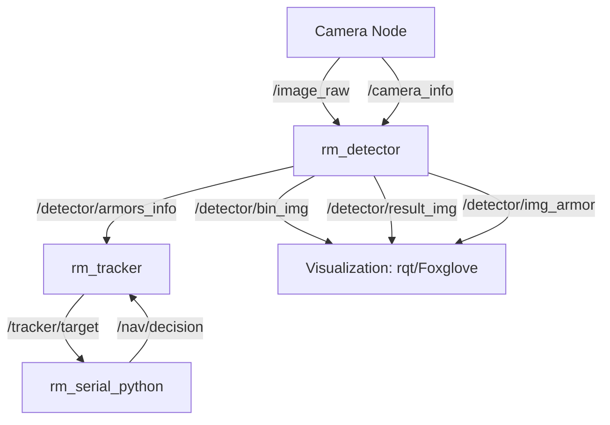

# 阅读理解-解释文档

# RoboMaster 视觉自瞄系统技术文档

## 1. 项目定位与背景

### 1.1 项目定位

本项目是 RoboMaster 战队视觉自瞄系统的一部分，旨在为机器人提供**实时、稳定的目标检测与追踪能力**。系统通过**相机采集 → 装甲板识别（基于灯条与数字分类）→ 目标追踪（IMM-3D 融合）→ 串口通信**的完整流程，将视觉结果（yaw、pitch、shoot_flag）传递给电控，实现精准打击。

---

### 1.2 参考与取舍

参考了多个开源 RoboMaster 战队实现（如 **PB_RM_Vision**、**HNUVISION_ROS2**、**FYT2024_vision**），最终选择**传统 OpenCV 灯条识别结合 ONNX 数字分类器**的方案，辅以 IMM-3D 追踪算法。

- **优点**：
    - 轻量级，实时性强，适合嵌入式设备；
    - ONNX 数字分类器提升装甲板识别精度；
    - IMM-3D（CV+CA 模型）增强追踪稳定性；
    - 易于调试，参数可动态调整。
- **缺点**：
    - 灯条检测依赖光照条件和阈值调节；
    - 数字分类器依赖预训练模型，需适配不同环境；
    - IMM 模型较为简单，未引入非线性滤波。

---

### 1.3 项目目标

- 实现实时装甲板检测（基于灯条与数字分类）；
- 提供稳定的目标追踪（基于 IMM-3D，单位：毫米）；
- 支持多种相机（USB、Hik、MindVision）；
- 通过串口与电控交互，传输 yaw、pitch 和射击指令；
- 提供完善的调试工具链（rqt、Foxglove、动态调参）。

---

### 1.4 实现思路

1. **相机驱动**：采集图像与相机内参（`/image_raw`, `/camera_info`）。
2. **装甲板检测**：
    - 使用 OpenCV 进行图像预处理（二值化、轮廓检测）；
    - 提取灯条（`Light` 类），基于面积、角度、颜色比等筛选；
    - 配对灯条形成装甲板（`Armor` 类），通过数字分类器（ONNX 模型）识别装甲板 ID；
    - 使用 PnP 解算 3D 位姿（dx, dy, dz）。
3. **目标追踪**：
    - 输入检测到的装甲板（`ArmorsCppMsg`）；
    - 使用 IMM-3D（CV+CA 模型）融合位置与速度；
    - 转换为枪管坐标系，结合弹道补偿计算 yaw、pitch；
    - 基于角度阈值判定是否射击。
4. **串口通信**：将追踪结果（yaw、pitch、shoot_flag）发送至电控。
5. **调试与可视化**：通过 rqt/Foxglove 显示二值化图像、检测框、追踪结果。

---

### 1.5 项目特色

- **模块化设计**：检测（`rm_detector`）、追踪（`rm_tracker`）、串口（`rm_serial_python`）分离，易于维护。
- **轻量级数字分类**：引入 ONNX 模型（`mlp.onnx`）进行装甲板数字识别，提升精度。
- **IMM-3D 追踪**：结合 CV（匀速）和 CA（匀加速）模型，适应目标动态变化。
- **动态调参**：支持 ROS2 参数动态调整，实时生效。
- **多相机支持**：兼容 USB、Hik、MindVision 相机，适配多种硬件环境。

---

## 2. 系统架构

### 2.1 模块组成

- **相机驱动**：`rm_vision_ros2_usb_camera`, `rm_vision_ros2_hik_camera`, `rm_vision_ros2_mindvision_camera`
- **装甲板检测**：`rm_detector`（C++，基于 OpenCV 和 ONNX）
- **装甲板追踪**：`rm_tracker`（Python，基于 IMM-3D 和弹道补偿）
- **串口通信**：`rm_serial_python`（Python，收发协议）
- **消息接口**：`rm_interfaces`（自定义 ROS2 消息）
- **启动管理**：`rm_vision_bringup`（Launch 文件整合）

---

### 2.2 节点通信关系

- **输入**：
    - `/image_raw`（`sensor_msgs/Image`）：相机原始图像；
    - `/camera_info`（`sensor_msgs/CameraInfo`）：相机内参与畸变系数。
- **处理**：
    - `rm_detector`：订阅 `/image_raw`, `/camera_info`，发布 `/detector/armors_info`（`rm_interfaces/ArmorsCppMsg`）。
    - `rm_tracker`：订阅 `/detector/armors_info`，发布 `/tracker/target`（`rm_interfaces/ArmorTracking`）。
- **输出**：
    - `/tracker/target`：yaw、pitch、shoot_flag；
    - `/detector/bin_img`, `/detector/result_img`, `/detector/img_armor`：调试图像。
- **串口**：
    - `rm_serial_python`：订阅 `/tracker/target`，发送至电控；接收电控的 `detect_color`，发布至 `/nav/decision`。

---

### 2.3 架构图 (Mermaid)



---

### 2.4 架构特点

- **模块化**：各模块独立运行，易于开发与维护。
- **实时性**：检测与追踪优化为低延迟，适配嵌入式设备。
- **可调试性**：支持动态调参与图像可视化，便于现场调整。
- **扩展性**：支持多种相机与协议，易于扩展新功能。

---

## 3. 相机驱动模块

### 3.1 Hik 相机节点

- **功能**：采集 Hik 工业相机图像，发布 `/image_raw` 和 `/camera_info`。
- **配置文件**：`rm_vision_ros2_hik_camera/config/camera_params.yaml`, `camera_info.yaml`。
- **依赖**：`rclcpp`, `sensor_msgs`, `image_transport`, `camera_info_manager`。

---

### 3.2 MindVision 相机节点

- **功能**：采集 MindVision 工业相机图像，发布 `/image_raw` 和 `/camera_info`。
- **配置文件**：`rm_vision_ros2_mindvision_camera/config/camera_params.yaml`, `camera_info.yaml`。
- **依赖**：同 Hik 相机。

---

### 3.3 USB 相机节点

- **功能**：支持通用 USB 相机，发布 `/image_raw` 和 `/camera_info`。
- **配置文件**：`rm_vision_ros2_usb_camera/config/camera_params.yaml`, `camera_info.yaml`。
- **默认参数**：若无 `camera_info`，使用默认内参（1320x1320 焦距，609x457 光心）。
- **依赖**：`rclcpp`, `sensor_msgs`, `image_transport`, `cv_bridge`, `camera_info_manager`, `OpenCV`。

---

### 3.4 常见问题

- **相机无法打开**：检查 `/dev/video*` 权限（`sudo chmod 777 /dev/video0`）或设备占用（`fuser /dev/video0`）。
- **帧率过低**：降低分辨率或调整 `exposure_time`、`gain`。
- **内参缺失**：运行标定工具生成 `camera_info.yaml`。

---

## 4. 装甲板检测模块

### 4.1 模块概览

- **节点**：`rm_detector`（`armor_detector_opencv_node.cpp`）
- **功能**：
    - 使用 OpenCV 进行图像预处理与灯条检测；
    - 引入 ONNX 数字分类器（`mlp.onnx`）识别装甲板 ID；
    - 通过 PnP 解算装甲板 3D 位姿（dx, dy, dz，单位：米）。
- **依赖**：`rclcpp`, `sensor_msgs`, `std_msgs`, `cv_bridge`, `opencv4`, `rm_interfaces`, `ament_index_cpp`.

---

### 4.2 输入 / 输出接口

- **输入**：
    - `/image_raw`（`sensor_msgs/Image`）：BGR 图像；
    - `/camera_info`（`sensor_msgs/CameraInfo`）：相机内参与畸变系数。
- **输出**：
    - `/detector/armors_info`（`rm_interfaces/ArmorsCppMsg`）：装甲板列表（class_id, dx, dy, dz）。
    - `/detector/bin_img`：二值化图像（调试用）；
    - `/detector/result_img`：绘制灯条与装甲板框的图像；
    - `/detector/img_armor`：装甲板 ROI 图像。

---

### 4.3 处理管线

1. **图像预处理**（`ArmorDetector::process`）：
    - 转换 BGR 到灰度图；
    - 根据 `detect_color`（0=红, 1=蓝, 2=自动）分离颜色通道；
    - 使用 `binary_val`（默认 120）进行二值化。
2. **灯条检测**（`ArmorDetector::find_lights`）：
    - 提取轮廓，筛选符合条件的灯条（`Light` 类）；
    - 筛选条件：面积（`light_area_min`）、高宽比（`light_h_w_ratio`）、角度（`light_angle_min/max`）、颜色比（`light_red/blue_ratio`）。
3. **装甲板匹配**（`ArmorDetector::is_armor`）：
    - 配对灯条，检查高度比（`height_rate_tol`）、间距倍数（`height_multiplier_min/max`）；
    - 提取装甲板 ROI，使用 ONNX 分类器（`NumberClassifier::classify`）识别数字，确定 `armor_id`。
4. **位姿解算**（`PNP::processArmorCorners`）：
    - 使用灯条端点（`light1_up/down`, `light2_up/down`）作为图像点；
    - 根据 `armor_id` 选择 3D 模型点（大装甲板 100x100mm，小装甲板 134x58mm）；
    - 使用 `solvePnP` 计算位姿（dx, dy, dz），支持几何中心替代光心（`use_geometric_center`）。

---

### 4.4 参数一览

配置文件：`rm_detector/config/detector_params.yaml`

| 参数名 | 类型 | 默认值 | 描述 |
| --- | --- | --- | --- |
| `cls_model_file` | string | `mlp.onnx` | ONNX 分类模型文件名 |
| `cls_invert_binary` | bool | false | 是否反转二值化结果 |
| `light_area_min` | int | 5 | 灯条最小面积（像素） |
| `light_h_w_ratio` | double | 3.0 | 灯条高宽比阈值 |
| `light_angle_min` | int | -35 | 灯条角度最小值（度） |
| `light_angle_max` | int | 35 | 灯条角度最大值（度） |
| `light_red_ratio` | double | 2.0 | 红色灯条颜色比阈值 |
| `light_blue_ratio` | double | 2.0 | 蓝色灯条颜色比阈值 |
| `height_rate_tol` | double | 1.3 | 灯条高度比容差 |
| `height_multiplier_min` | double | 1.8 | 灯条间距与高度倍数最小值 |
| `height_multiplier_max` | double | 3.0 | 灯条间距与高度倍数最大值 |
| `binary_val` | int | 120 | 二值化阈值 |
| `detect_color` | int | 2 | 检测颜色（0=红, 1=蓝, 2=自动） |
| `display_mode` | int | 0 | 显示模式（0=关闭, 1=二值化, 2=全） |
| `use_geometric_center` | bool | true | 是否使用几何中心替代光心 |
| `print_period_ms` | int | 1000 | 日志打印周期（毫秒） |

**装甲板 ID 定义**（`Armor::get_id`）：

| 编号 | 含义 | 序号 |
| --- | --- | --- |
| B1 | 蓝方1号 装甲板 | 0 |
| B2 | 蓝方2号 装甲板 | 1 |
| B3 | 蓝方3号 装甲板 | 2 |
| B4 | 蓝方4号 装甲板 | 3 |
| B5 | 蓝方5号 装甲板 | 4 |
| B7 | 蓝方哨兵 装甲板 | 5 |
| R1 | 红方1号 装甲板 | 6 |
| R2 | 红方2号 装甲板 | 7 |
| R3 | 红方3号 装甲板 | 8 |
| R4 | 红方4号 装甲板 | 9 |
| R5 | 红方5号 装甲板 | 10 |
| R7 | 红方哨兵 装甲板 | 11 |
- **说明**：
    - `armor_id` 由灯条颜色（`color`：0=红, 1=蓝）和分类器结果（`class_id`：0, 1, 2）确定；
    - 红方：`class_id=0` → R1(6), `class_id=1` → R3(8), `class_id=2` → R7(11)；
    - 蓝方：`class_id=0` → B1(0), `class_id=1` → B3(2), `class_id=2` → B7(5)；
    - 无效 ID 返回 -1。

---

### 4.5 动态调参与可视化

- **动态调参**：
    - 使用 `rqt`：`Plugins → Configuration → Parameters`，修改 `binary_val`, `detect_color`, `display_mode` 等。
    - 命令行：`ros2 param set /rm_detector binary_val 120`。
- **可视化**：
    - `/detector/bin_img`：二值化图像，检查灯条轮廓；
    - `/detector/result_img`：绘制灯条与装甲板框；
    - `/detector/img_armor`：装甲板 ROI，验证数字分类。

---

### 4.6 性能与稳定性

- **性能**：
    - 在 1080p 分辨率下，帧率约 30-60 FPS（视硬件）。
    - ONNX 分类器推理时间约 1-2ms（CPU）。
- **稳定性**：
    - 灯条检测对光照敏感，需调整 `binary_val` 和颜色比。
    - 数字分类器依赖训练数据，需适配赛场环境。
    - PnP 解算依赖相机标定，建议使用高精度 `camera_info`。

---

### 4.7 常见问题与排查

- **灯条未检测到**：
    - 检查 `/detector/bin_img`，调整 `binary_val` 或 `light_red/blue_ratio`。
    - 确认相机曝光（`exposure_time`, `gain`）。
- **装甲板 ID 错误**：
    - 检查 `/detector/img_armor`，验证 ROI 图像质量。
    - 确认 `cls_model_file` 路径正确，模型适配环境。
- **PnP 解算失败**：
    - 检查 `/camera_info` 是否正确；
    - 尝试启用 `use_geometric_center`。

---

### 4.8 与追踪模块的对接

- **输出格式**：`rm_interfaces/ArmorsCppMsg` 包含装甲板列表（`armor_id`, `dx`, `dy`, `dz`）。
- **对接流程**：
    - `rm_tracker` 订阅 `/detector/armors_info`；
    - 将 dx, dy, dz（米）转换为毫米，输入 IMM-3D 滤波器；
    - 输出 `/tracker/target`（yaw, pitch, shoot_flag）。

---

### 4.9 调参与验收建议

- **调参顺序**：
    1. 调整 `binary_val` 确保灯条清晰可见；
    2. 优化 `light_area_min`, `light_h_w_ratio`, `light_angle_min/max` 筛选灯条；
    3. 调整 `height_rate_tol`, `height_multiplier_min/max` 优化装甲板匹配；
    4. 验证数字分类器（`/detector/img_armor`），必要时重新训练 `mlp.onnx`。
- **验收标准**：
    - `/detector/armors_info` 持续发布，`armor_id` 正确；
    - `/detector/result_img` 显示稳定的灯条与装甲板框；
    - FPS 维持在 30 以上（1080p）。

---

## 5. 装甲板追踪模块

### 5.1 功能定位

- **节点**：`rm_tracker`（`armor_tracker_node.py`）
- **功能**：
    - 接收检测结果（`ArmorsCppMsg`），选择目标；
    - 使用 IMM-3D（CV+CA 模型）融合位置与速度；
    - 转换到枪管坐标系，结合弹道补偿计算 yaw、pitch；
    - 基于角度阈值判定射击（`shoot_flag`）。

---

### 5.2 输入 / 输出

- **输入**：
    - `/detector/armors_info`（`rm_interfaces/ArmorsCppMsg`）：装甲板位置（dx, dy, dz，单位：米）；
    - `/nav/decision`（`rm_interfaces/Decision`）：电控反馈的 `detect_color`。
- **输出**：
    - `/tracker/target`（`rm_interfaces/ArmorTracking`）：yaw（度）、pitch（度）、shoot_flag（0/1）。

---

### 5.3 核心流程

1. **目标选择**（`Tracker::update`）：
    - 根据 `tracking_color`（0=红, 1=蓝, 10=不追）筛选装甲板；
    - 使用深度容差（`track_deep_tol`）选择最近目标；
    - 若 `follow_decision=1`，动态切换 `tracking_color`。
2. **IMM-3D 滤波**（`MultiDimKalmanFilter`）：
    - 输入：装甲板位置（毫米）；
    - 模型：CV（匀速，6维：x,y,z,vx,vy,vz）+ CA（匀加速，9维：x,y,z,vx,vy,vz,ax,ay,az）；
    - 参数：`kf_sigma_acc`, `kf_sigma_jerk`, `kf_meas_std`, `kf_mu_cv/ca`, `kf_trans_00/01/10/11`, `kf_a_init_std`；
    - 输出：平滑后的位置与速度。
3. **坐标转换与弹道补偿**（`Tracker::ballistic_compensation`）：
    - 转换相机系到枪管系（`camera_tx/ty/tz_m`, `camera_yaw/pitch/roll_deg`）；
    - 迭代解算 yaw、pitch，考虑弹速（`bullet_speed_mps`）、重力（`gravity`）、延迟（`extra_latency_s`）。
4. **射击判定**（`Tracker::if_shoot`）：
    - 检查 yaw、pitch 是否在阈值内（`shoot_yaw_max`, `shoot_pitch_max`）；
    - 输出 `shoot_flag`（1=射击，0=不射击）。

---

### 5.4 参数说明

配置文件：`rm_tracker/config/tracker_params.yaml`

| 参数名 | 类型 | 默认值 | 描述 |
| --- | --- | --- | --- |
| `log_throttle_ms` | int | 1000 | 日志节流周期（毫秒） |
| `fps_window_sec` | double | 1.0 | FPS 统计窗口（秒） |
| `use_kf` | bool | true | 是否启用 IMM-3D 滤波 |
| `frame_add` | int | 60 | 目标丢失前保留帧数 |
| `tracking_color` | int | 0 | 追踪颜色（0=红, 1=蓝, 10=不追） |
| `follow_decision` | int | 0 | 是否跟随电控决策（0=否, 1=是） |
| `track_deep_tol` | double | 10.0 | 深度容差（毫米） |
| `shoot_yaw_max` | double | 1.5 | 最大 yaw 角度（度） |
| `shoot_pitch_max` | double | 1.0 | 最大 pitch 角度（度） |
| `camera_tx_m` | double | 0.0 | 相机 X 平移（米） |
| `camera_ty_m` | double | 0.0 | 相机 Y 平移（米） |
| `camera_tz_m` | double | -0.03 | 相机 Z 平移（米） |
| `camera_yaw_deg` | double | 4.0 | 相机 yaw 角（度） |
| `camera_pitch_deg` | double | 0.0 | 相机 pitch 角（度） |
| `camera_roll_deg` | double | 0.0 | 相机 roll 角（度） |
| `kf_sigma_acc` | double | 2.0 | 加速度噪声标准差 |
| `kf_sigma_jerk` | double | 20.0 | jerk 噪声标准差 |
| `kf_meas_std` | double | 0.01 | 测量噪声标准差 |
| `kf_mu_cv` | double | 0.6 | CV 模型权重 |
| `kf_mu_ca` | double | 0.4 | CA 模型权重 |
| `kf_trans_00` | double | 0.9 | CV→CV 转移概率 |
| `kf_trans_01` | double | 0.1 | CV→CA 转移概率 |
| `kf_trans_10` | double | 0.1 | CA→CV 转移概率 |
| `kf_trans_11` | double | 0.9 | CA→CA 转移概率 |
| `kf_a_init_std` | double | 3.0 | 初始加速度标准差 |
| `use_ballistics` | bool | true | 是否启用弹道补偿 |
| `bullet_speed_mps` | double | 30.0 | 弹速（米/秒） |
| `gravity` | double | 9.81 | 重力加速度（米/秒²） |
| `extra_latency_s` | double | 0.02 | 额外延迟补偿（秒） |

---

### 5.5 调试与可视化

- **动态调参**：
    - 使用 `rqt` 或命令行：`ros2 param set /armor_tracker_node tracking_color 0`。
    - 调整 `track_deep_tol`, `shoot_yaw_max`, `shoot_pitch_max` 优化追踪与射击。
- **可视化**：
    - 检查 `/tracker/target` 的 yaw、pitch、shoot_flag；
    - 使用 Foxglove 监控 `/detector/result_img` 与 `/tracker/target`。

---

### 5.6 常见问题

- **追踪丢失**：
    - 增大 `frame_add` 延长目标保留时间；
    - 调整 `track_deep_tol` 放宽深度容差。
- **yaw/pitch 不准**：
    - 检查外参（`camera_tx/ty/tz_m`, `camera_yaw/pitch/roll_deg`）；
    - 验证弹道参数（`bullet_speed_mps`, `extra_latency_s`）。
- **射击不触发**：
    - 减小 `shoot_yaw_max`, `shoot_pitch_max`；
    - 确认目标被正确选择（`tracking_color`）。

---

## 6. 串口通信模块

### 6.1 功能定位

- **节点**：`rm_serial_python`（`rm_serial_node.py`）
- **功能**：
    - 订阅 `/tracker/target`，发送 yaw、pitch、shoot_flag 至电控；
    - 接收电控的 `detect_color`，发布至 `/nav/decision`。

---

### 6.2 输入 / 输出

- **输入**：
    - `/tracker/target`（`rm_interfaces/ArmorTracking`）：yaw、pitch、shoot_flag。
- **输出**：
    - `/nav/decision`（`rm_interfaces/Decision`）：电控反馈的 `detect_color`（0=红, 1=蓝）。
- **串口**：
    - 发送：`<BffBi>`（header=0x5A, yaw, pitch, shoot, match）。
    - 接收：`<BBfffiH>`（header=0xA5, detect_color, roll, pitch, yaw, match, checksum）。

---

### 6.3 数据协议

- **发送报文**（视觉 → 电控，14 字节）：
    - 格式：`<BffBi>`（小端序）；
    - 字段：header（0x5A）、yaw（float32）、pitch（float32）、shoot（uint8, 0/1）、match（int32, 序号）。
- **接收报文**（电控 → 视觉，20 字节）：
    - 格式：`<BBfffiH>`（小端序）；
    - 字段：header（0xA5）、detect_color（uint8, 0=红, 1=蓝）、roll/pitch/yaw（float32）、match（int32）、checksum（uint16, 未使用）。

---

### 6.4 参数配置

配置文件：`rm_serial_python/config/serial_params.yaml`

| 参数名 | 类型 | 默认值 | 描述 |
| --- | --- | --- | --- |
| `device_name` | string | `/dev/ttyUSB0` | 串口设备路径 |
| `baud_rate` | int | 115200 | 波特率 |
| `flow_control` | int | 0 | 流控（0=无） |
| `parity` | int | 0 | 校验位（0=无） |
| `stop_bits` | int | 1 | 停止位 |

---

### 6.5 使用方法

- 启动：`ros2 launch rm_serial_python rm_serial.launch.py`；
- 确保串口设备正确连接（`/dev/ttyUSB0`）；
- 检查 `/nav/decision` 确认电控反馈。

---

### 6.6 调试与排错

- **串口无法打开**：
    - 检查设备权限：`sudo chmod 777 /dev/ttyUSB0`；
    - 确认设备路径：`ls /dev/tty*`。
- **数据丢失**：
    - 检查波特率（`baud_rate`）与电控匹配；
    - 验证 USB 供电稳定。
- **日志查看**：
    - 检查节点日志，确认发送/接收报文内容。

---

### 6.7 与系统关系

- **上游**：依赖 `/tracker/target` 提供 yaw、pitch、shoot_flag；
- **下游**：向电控发送指令，接收 `detect_color` 反馈至 `/nav/decision`；
- **影响**：串口稳定性直接影响电控指令执行。

---

## 7. 系统启动与 Bringup

### 7.1 功能定位

- **包**：`rm_vision_bringup`
- **功能**：整合相机、检测、追踪、串口节点，提供一键启动。

---

### 7.2 启动方式一览

- `usb_nav.launch.py`：USB 相机 + 检测 + 追踪；
- `hik_nav.launch.py`：Hik 相机 + 检测 + 追踪；
- `mv_nav.launch.py`：MindVision 相机 + 检测 + 追踪；
- `rm_serial.launch.py`：串口通信。

---

### 7.3 启动示例

```bash
ros2 launch rm_vision_bringup usb_nav.launch.py
```

加载 `camera_params.yaml`, `camera_info.yaml`, `detector_params.yaml`, `tracker_params.yaml`。

---

### 7.4 Launch 文件组成

- **节点**：
    - 相机节点（`hik_camera_node` / `mv_camera_node` / `usb_camera_node`）；
    - `armor_detector_opencv_node`；
    - `armor_tracker_node`；
    - `rm_serial_node`。
- **参数**：从 `config/` 加载相机、检测、追踪参数。

---

### 7.5 配置参数

- 相机：`exposure_time`, `gain`, `camera_info`；
- 检测：`detector_params.yaml`；
- 追踪：`tracker_params.yaml`；
- 串口：`serial_params.yaml`。

---

### 7.6 调试建议

- **启动顺序**：
    1. 启动相机节点，检查 `/image_raw`；
    2. 启动检测节点，检查 `/detector/armors_info`；
    3. 启动追踪节点，检查 `/tracker/target`；
    4. 启动串口节点，检查 `/nav/decision`。
- **日志检查**：使用 `ros2 topic echo` 或 Foxglove。
- **帧率优化**：关闭 `display_mode`（设为 0）减少计算量。

---

## 8. 可视化与调试工具

### 8.1 rqt 工具

- **功能**：查看图像（`/detector/bin_img`, `/detector/result_img`）、动态调参。
- **启动**：`rqt` → `Plugins → Image View / Configuration`。

---

### 8.2 Foxglove Studio

- **功能**：Web 端可视化，支持 `/image_raw`, `/detector/*`, `/tracker/target`。
- **启动**：`ros2 launch foxglove_bridge foxglove_bridge_launch.xml port:=8765`。
- **连接**：浏览器访问 `http://<IP>:8765`。

---

### 8.3 动态调参方法

- **rqt**：`Plugins → Configuration → Parameters`；
- **命令行**：
    
    ```bash
    ros2 param set /rm_detector binary_val 120
    ros2 param set /armor_tracker_node tracking_color 0
    ```
    

---

### 8.4 调试流程建议

1. 验证相机：检查 `/image_raw` 是否正常；
2. 调试检测：调整 `binary_val`, 查看 `/detector/bin_img`；
3. 优化追踪：调整 `track_deep_tol`, 验证 `/tracker/target`；
4. 检查串口：确认 `/nav/decision` 输出 `detect_color`。

---

## 9. 常见问题与踩坑总结

### 9.1 相机相关

- **问题**：相机无法打开。
    - **解决**：`sudo chmod 777 /dev/video0`；检查设备占用（`fuser /dev/video0`）。
- **问题**：帧率过低。
    - **解决**：降低分辨率，调整 `exposure_time`, `gain`。

---

### 9.2 串口相关

- **问题**：串口无法打开。
    - **解决**：`sudo chmod 777 /dev/ttyUSB0`；确认设备路径。
- **问题**：数据丢失。
    - **解决**：检查 `baud_rate`；验证 USB 供电。

---

### 9.3 ROS2 环境

- **问题**：节点未启动。
    - **解决**：`source /opt/ros/humble/setup.bash`；`source install/setup.bash`。
- **问题**：话题冲突。
    - **解决**：设置 `ROS_DOMAIN_ID`：
        
        ```bash
        echo "export ROS_DOMAIN_ID=1" >> ~/.bashrc
        source ~/.bashrc
        ```
        

---

### 9.4 参数与调试

- **问题**：灯条识别失败。
    - **解决**：调整 `binary_val`, `light_red/blue_ratio`。
- **问题**：追踪丢失。
    - **解决**：增大 `frame_add`, `track_deep_tol`。
- **问题**：射击不触发。
    - **解决**：减小 `shoot_yaw_max`, `shoot_pitch_max`。

---

### 9.5 系统与部署

- **问题**：GRUB 卡住。
    - **解决**：
        
        ```bash
        nano /etc/default/grub
        GRUB_RECORDFAIL_TIMEOUT=3
        sudo update-grub
        ```
        
- **问题**：内存不足。
    - **解决**：启用 Swap：
        
        ```bash
        sudo fallocate -l 4G /swapfile
        sudo chmod 600 /swapfile
        sudo mkswap /swapfile
        sudo swapon /swapfile
        ```
        

---

### 9.6 部署技巧

- **开机自启**：
在 `/etc/systemd/system/` 下新建 `cv.service`，自动运行 `start.sh`。
- **远程调试**：
使用 Android + Termux，通过 USB 网络共享 + `ssh` 登录小电脑。
- **快速重启节点**：
在 `.bashrc` 中加入：
    
    ```bash
    alias stop='pkill -9 -f ros2'
    ```
    

---

### 9.7 调试经验

- 灯条识别失败 → 调整 `binary_val`, 检查 `/detector/bin_img`。
- 装甲板 ID 错误 → 检查 `/detector/img_armor`，验证 `cls_model_file`。
- 追踪频繁丢失 → 增大 `frame_add`, 调整 `track_deep_tol`。
- 相机过曝/过暗 → 调整 `exposure_time` 和 `gain`。
- 串口偶尔卡死 → 检查 USB 供电和驱动版本。

---

## 10. 参考资料

### 10.1 开源项目

- [RM_VISION](https://gitlab.com/rm_vision)

### 10.2 驱动与 SDK

- **HikRobot SDK**：https://www.hikrobotics.com/cn/machinevision/service/download/?module=0
- **MindVision SDK**：https://www.mindvision.ltd/Service-Support/Software-Download.html
- **ROS2 Humble**：https://docs.ros.org/en/humble/index.html

### 10.3 ROS2 相关

- ROS2 文档：https://docs.ros.org/en/humble/
- rclpy/rclcpp API：https://docs.ros.org/en/humble/Libraries.html

### 10.4 可视化工具

- rqt：https://ros.org/wiki/rqt
- Foxglove Studio：https://foxglove.dev/docs

### 10.5 系统与环境

- Ubuntu 22.04 配置：https://www.notion.so/Linux-1dfa064aa17880ccb323f368fdef401c?pvs=21
- OpenCV 4.x：https://opencv.org/releases/

---

## 11. 总结与展望

### 11.1 总结

本项目实现了 RoboMaster 视觉自瞄系统的完整功能，包括：

- 相机图像采集与标定；
- 基于 OpenCV 和 ONNX 分类器的装甲板检测；
- 基于 IMM-3D 的装甲板追踪；
- 串口通信与电控交互；
- 统一的启动与调试工具链。

系统具备**实时性、模块化、可扩展**的特点，能够在实际赛场部署中稳定运行。

---

### 11.2 不足与改进方向

- **光照依赖**：OpenCV 灯条检测对光照敏感，需调整 `binary_val` 和颜色比（`light_red/blue_ratio`）。
- **分类器依赖**：ONNX 分类器（`mlp.onnx`）依赖预训练模型，需适配不同环境。
- **追踪模型简单**：IMM-3D 使用线性 CV 和 CA 模型，可引入 EKF/UKF 或装甲板运动学模型。
- **串口协议有限**：当前协议仅传输 yaw、pitch、shoot_flag，可扩展更多状态量。
- **多目标处理不足**：目前仅追踪单一目标，可支持多目标同时跟踪与优先级选择。

---

### 11.3 展望

- **引入深度学习**：在算力允许的情况下，融合传统检测与轻量级神经网络（如 YOLO-Nano）。
- **融合导航信息**：结合定位与地图信息，实现更智能的目标选择策略。
- **跨平台部署**：支持 Docker 化，简化环境配置，提升可移植性。
- **多目标追踪**：支持多目标同时跟踪与优先级选择。
- **高级滤波**：探索 EKF/UKF 或装甲板运动学模型，提升运动预测精度。

---

### 11.4 致谢

感谢 RoboMaster 社区、开源项目 RM_Vision 以及 DT46 战队的贡献与支持。特别感谢 Kielas 对项目的开发维护与文档编写。

---

本项目为 DT46 战队提供了一个轻量级、实用的视觉自瞄方案，随着算法和硬件的迭代，系统仍有很大的优化空间。